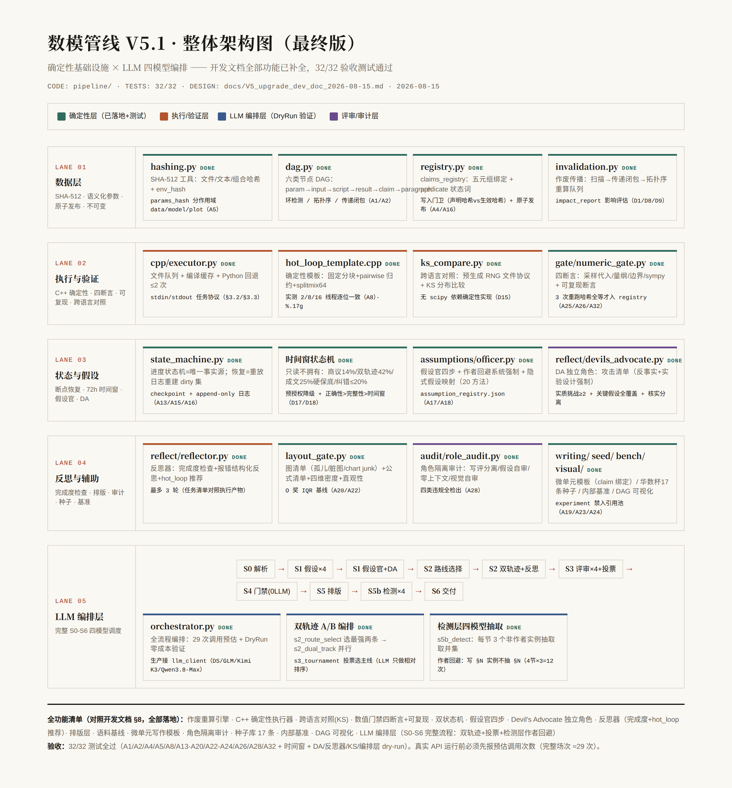

# Multi-agent Mathematical Modeling（数模管线）

> **一句话：为数学建模竞赛（MCM/ICM、华数杯等）打造的 72 小时多智能体解题管线——四模型商议建模、双轨迹并行求解、SHA-512 作废重算引擎保证所有操作基于正确数据、评委视角终评把关后交付论文。**

输入一道竞赛题（官方题目 PDF + 数据包），输出一篇可直接提交的论文（MCM 25 页 LaTeX / 华数杯官方模板版）。全流程覆盖：**审题 → 假设管理 → 建模商议 → 双轨迹求解 → 评审 → 数值门禁 → 成文 → 检测 → 交付**。

## 一张图看懂（V5.1 管线）



> V5.0 时代流程图（Stage 0-7 设计稿）：`docs/flowchart_v5_final.png`

## 完整工作流（V5.1，S0–S6）

```
S0 问题解析 → S1 假设生成(四建模手) → S1 假设官审查 → S1 DA 挑战
  → S2 路线选择(选最强两条) → S2 双轨迹执行 + 反思器完成度检查
  → S3 四模型评审 → S3 锦标赛投票选主线 → S4 数值门禁(0 LLM，确定性)
  → S5 排版(视觉官) → S5b 检测层四模型抽取(作者回避) → S6 交付
```

完整场次 LLM 调用预估 **29 次**（S0:1 + S1:4+1+1 + S2:1+2 + S3:4+1 + S4:0 + S5:1 + S5b:12 + S6:1）。

### 72 小时竞赛时间窗

| 阶段 | 时间 | 占比 | 说明 |
|---|--:|:--:|---|
| 0 进气 + 1 结构化 | 3h | 4% | 快，不纠结 |
| 2 三 Agent 商议 | 10h | 14% | **深度的主场**：reasoning 拉满、轮次不设硬上限 |
| 3 双轨迹执行 | 30h | 42% | 计算主体（含验证产物） |
| 4 产物级评审 | 4h | 6% | 有产物可看，高效 |
| 5 成文 | 18h | **25% 硬保底** | 纠错循环永远不得侵蚀 |
| 6-7 一致性+对抗 | 7h | 10% | 超限带风险交付，不消内容保平安 |

## 核心机制（它凭什么保证质量）

1. **四 Agent 商议 Deliberation**：DeepSeek/GLM/Kimi K3/Qwen3.8-Max 四个不同模型家族的建模手独立深推 → 交换批评 → 各自修订，修订说明逐条引用被采纳/拒绝的批评。**分歧不强制收敛**——多样性是资产，不是 bug。
2. **双轨迹 A/B 并行**：从商议方案中选最强两条独立路线并行执行，产出后投票选主线。不把鸡蛋放在一个模型的一条思路上。
3. **声明注册表（claims registry）**：散文不是主产物，注册表才是。每条数值/结论声明带 scope 四元组（口径/群体/时代/规则）、provenance（结果仓路径+key）、依赖关系——①同名同口径不同值 = 脚本阻断；②派生量必须能反算（149/259=57.53% ✓）；③caveat 沿依赖图强制传播（§5 承认的局限不许在 §7 被静默丢弃）；④强度分级（descriptive/associational/causal/validated）与证据类型（replay/holdout/simulation/external）的越级规则表。
4. **检测层四模型独立抽取 + 作者回避**：四个不同家族独立抽取全文声明取并集（漏抽模式不相关）；写 §N 的实例不得参与 §N 的抽取裁决；种子矛盾库注入式回归测试（召回率是硬指标，漏检自动入库归因）。
5. **验证产物强制**：每条路线立项时必须声明配套验证——反演→模拟恢复实验；预测→holdout；优化→约束审计+下界。哈希链只防篡改不防错跑，**验证产物才是「跑对了」的证据**。
6. **确定性一致性层**：hash/manifest/四方核对/格式断言全部脚本化并挂 build 钩子（不靠 Agent 自觉）。否决权只留给造假类（编造数据/文献/版本号/漏问）；其余问题降级为 risk_report 随交付附出。
7. **评委 skill v2.8 终评（四评 + 全量数据复算）**：GLM/Kimi/新开 DeepSeek 三个**零撰写上下文**实例全权评审 + Qwen3.8-Max 第 4 评（校准阶梯）+ 扣分记录制评分引擎 + 真人常模分位映射 + 四方数字 diff + **全量数据复算闭环**（按论文逻辑重算每个注册数字；复算不符先四重自查评审脚本，脚本无问题才标记论文错误）。排版检查全交 Qwen 视觉官。
8. **作废重算引擎（V5.1 新增，数据正确性铁律）**：六类节点依赖 DAG + SHA-512 三级新鲜度链——任何上游修改（数据/脚本/参数）→ 传递闭包下游全部作废重算；写入门卫拦截旧进程回灌；原子发布+断点恢复。**所有操作基于正确的数据，保证每个数字可复现。**
9. **C++ OpenMP 确定性执行器（V5.1 新增，算力优势）**：固定分块+pairwise 归约+counter-based RNG，实测 2/8/16 线程结果逐位一致；文件队列+编译缓存+Python 回退。
10. **假设官 + Devil's Advocate**：假设生命周期四步（登记→必要性→挑战→敏感度）+ 隐式假设映射表；DA 专职挑刺（反事实+实验设计强制）。

## 模型角色矩阵

| 角色 | 模型 |
|---|---|
| 建模手 ×4（S2 双轨迹） | DeepSeek V4 Pro / GLM 5.2 / **Kimi K3** / **Qwen3.8-Max** |
| 假设官 / Devil's Advocate | 独立实例（作者回避系统强制） |
| 反思器（完成度检查+hot_loop 推荐） | 确定性为主 + 独立实例 |
| S3 评审 ×4（相对排序）+ 投票 | DeepSeek / GLM / Kimi / Qwen |
| 检测层抽取 ×4（作者回避：写 §N 不抽 §N） | DeepSeek / GLM / Kimi / Qwen |
| 评委终评 v2.8 四评（零撰写上下文 + 扣分制 + 分位映射 + 全量数据复算） | GLM / Kimi / DeepSeek 全权 + Qwen3.8-Max（校准阶梯） |
| 视觉核查 + 排版检查 | Qwen3.8-Max 视觉官（排版检查全交千问） |
| 确定性层（作废引擎/门禁/C++ 执行器/状态机） | 纯脚本，0 LLM，挂 build 钩子 |

## 实战记录（产物全部在 docs/，可追溯）

| 场次 | 产物 | 要点 |
|---|---|---|
| 2026 MCM C（DWTS 淘汰预测） | `docs/DWTS_2026C_v5.pdf`（15 页 LaTeX）+ `docs/v5_run/` 全部运行产物 | V5 首战：registry 种子回归 5/5、四方核对 34/34、模拟恢复实验证伪「回代 100%」并如实写进论文 |
| 华数杯 2026C（算电协同调度） | 12 页官方模板版 | 调度贪心三原则、C++ OpenMP 重写、消融归因 |
| 55 题真题批测 | 技能库基准文档 | 平均 80.4（⚠️ 子代理自评口径，见下） |

## 仓库结构

```
pipeline/                           # V5.1 可执行管线（tag v5.1-pipeline-full，32/32 测试）
  engine/                           #   作废重算引擎：SHA-512 哈希/DAG/registry 写入门卫/传播调度
  cpp/                              #   C++ OpenMP 执行器：队列/编译缓存/回退/KS 对照/确定性模板
  gate/  state/  assumptions/       #   数值门禁四断言 / 双状态机 / 假设官
  reflect/                          #   反思器 + Devil's Advocate
  layout/  writing/  audit/         #   排版层 / 微单元模板 / 角色隔离审计
  seed/  bench/  visual/  baseline/ #   种子库17条 / 内部基准 / DAG可视化 / O奖基线
  orchestrator.py                   #   LLM 编排层 S0-S6（DryRun 零成本验证）
  PROJECT.md                        #   详细项目文档（总体架构/验收表/铁律）
skills/
  data-science/
    1start-mathmodel … 6verity/     # 6 阶段论文流水线
    math-brainstorm/  brute-force-think/   # 思路脑暴 / 暴力求解
    mathmodel-v2-pipeline/          # 融合架构 v2.2
    mathmodel-pipeline-v3/          # 管线 v3.0 全题型执行手册
    mathmodel-judge-perspective/    # 评委视角 skill v2.8
    mathmodel-figure-templates/  typst-author/  doctor/  _references/
  multi-agent-pipeline/             # 6 阶段编排 + 架构全景
docs/
  V5_pipeline_design.md             # V5 管线完整设计（含设计决策溯源表）
  V5_upgrade_dev_doc_2026-08-15.md  # V5.1 升级开发文档（混合编码管线产出）
  V5_optimization_plan_2026-08-15.html  # 优化清单（16 项→15 项实施决策）
  V51_overall_arch.html/.png        # V5.1 整体架构图（README 所嵌）
  pipeline_4model_design.md         # 四模型化设计存档
  flowchart_v5*.png                 # V5.0 时代流程图
  2026_MCM-ICM_Problems/            # 2026 官方题目包
  v5_run/                           # V5 首战代码与全部运行产物
```

## 版本时间线（git tag，完整演进）

| tag | 里程碑 |
|---|---|
| `v2.2` | 融合架构 v2.2（mathmodel-v2-pipeline 初版：模式选择/建模辩论/数值验证门禁/五人评审团） |
| `pipeline-v2.3` `pipeline-v2.4` | C 题 O 奖论文精读驱动的迭代（优缺点强制/灵敏度标配/多模型对比） |
| `pipeline-v3.0` | 全题型版：437 篇 O 奖精读 → 4 条 100% 全票铁律 + 8 条高票规则 |
| `pipeline-v3.1` | 55 题批测驱动升级（交付优先序/图密度/灵敏度矩阵/数据辩护模板） |
| `v5-pipeline` | V5 管线全链路并入：三 Agent 商议引擎 / claims registry / 双轨迹实战 / 15 页论文 |
| `judge-v1.0` … `judge-v1.6` | 评委 skill 依据审计时代：官方 Triage 指南 → 84 篇 C 题逐篇精读 |
| `judge-v2.0` `judge-v2.1` | 437 篇全题型校准（HARD FAIL 扩至 10 项） |
| `judge-v2.3` | 两段式评审（确定性审计前置） |
| `judge-v2.5` `judge-v2.5.1` | 六阶段架构 + 三评仲裁 + 视觉评审层（冷启动五层参照系） |
| `judge-v2.6` | 终版：四方数字 diff + 名实审查 E1-E4 + 扣分记录制评分引擎 |
| `judge-v2.7` | 四评版：+Qwen3.8-Max 校准阶梯第 4 评；排版检查全交千问；四建模手（Kimi K3/Qwen3.8-Max） |
| `judge-v2.8` | **全量数据复算闭环**：按论文逻辑重算每个数字；复算不符先四重自查评审脚本，脚本无问题才标记论文错误 |
| `pipeline-4model-design` | 四模型化设计存档（Qwen 第四全权模型，2026-08-15 已实施） |
| `v5.1-pipeline-core` | V5.1 管线核心：作废重算引擎/C++ 确定性执行器/数值门禁/假设官/排版层，14 项验收 |
| `v5.1-pipeline-full` | **V5.1 全功能版**：+反思器/DA/双轨迹/检测层作者回避/KS 对照/编排层 S0-S6，32/32 验收 |

## 诚实边界（重要，引用本仓库数字前请读）

1. **55 题批测平均 80.4 是子代理自评口径**，非外部评审——两者必须分开标注，不可混用。
2. 评委 v2.6 首战：三评中位数与真人 80 分锚偏差 +3.5（达标）；**分位映射层尚未在评审管线中完全接线**，绝对分校准仍在进行。
3. 「多模型互证 16/16」等铁律来自 437 篇 **O 奖正样本**精读——正样本无对照组，属待验证假设（M/H 奖对照扫描是计划项）。
4. 四模型化升级与 V5.1 管线（2026-08-15 用户指令）**已实施**：四建模手（Kimi 建模手=K3、+Qwen3.8-Max）、四模型评审、四模型检测；评委四评走校准阶梯；**V5.1 可执行管线（pipeline/，32/32 验收）**：SHA-512 作废重算、C++ 确定性执行、数值门禁、假设官、DA、反思器、双轨迹、检测层作者回避。剩余判据（A3/A7/A9-A12/A21/A25/A27/A29-A31）待真实竞赛运行验证。
5. 论文语料库（437 篇 O 奖 PDF 全量精读笔记）在本地技能库中，不在本仓库。

## 与协同编码管线的接口

- 本仓库**不依赖**任何编码管线 skill；Stage 3 的计算需求（调度器/扫描器/管线脚本等）作为任务派发给协同编码管线执行。
- 通用铁律：写评分离、确定性门禁不认模型、72h 时间窗、评审零撰写上下文实例隔离、旧进程不杀并行对照。
- 三仓库分家说明：`docs/pipelines-split-2026-08.md`。

## 相关仓库

- 协同编码管线 → [Multi-agent-programming-pipeline](https://github.com/xtr0928/Multi-agent-programming-pipeline)
- 通用工具与编排 → [Multi-Agent](https://github.com/xtr0928/Multi-Agent)
