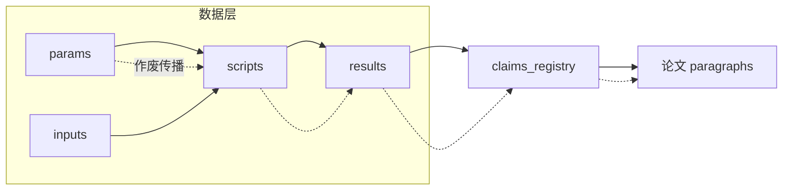

# 数模管线 V5 升级 · 完整开发文档

## 0 文档目的与范围

本文档是 V5 管线的开发级设计定稿，在已实战验证的 V5 Stage 0-7 主流程上做增改，不推翻既有四模型建模/评审/检测/评委 v2.7 校准阶梯骨架。

文档整合三路输入：

- **GLM 5.3 架构骨架**：模块清单、数据流、依赖图、C++ 执行器、状态机、角色矩阵、验收草案。
- **Kimi K3 独立审查**：38 条约束 C1-C38、25 条验收 A1-A25、22 条陷阱 P1-P22。
- **用户 2026-08-15 逐条指令**：数据正确性铁律、C++ + OpenMP 重写、排版直观性、假设官机制、数值验证门禁、断点恢复等全部最高优先级。

本文档的取舍原则：

1. **铁律不可违反**：写评分离；评审零撰写上下文实例隔离；作者回避；确定性门禁不认模型、挂 build 钩子；72h 时间窗成文 25% 硬保底；旧进程不杀、并行对照；竞赛窗口内 T5 同题信息权重 0。
2. **正确性 > 完整性 > 时间窗**：当铁律互相挤压时，按此优先级裁决；“超限带风险交付”只能牺牲完整性，绝不允许交付脏数据。
3. **数字纪律**：所有数量标准、超时、并行度、阈值均给出可测具体数值，不使用“适量”“合理”等模糊表述。
4. **可复现边界分治**：数值结果走哈希可复现断言；LLM 文本产物走 prompt+response 快照存档，不要求逐字复现。

---

## 1 总体架构（V5 Stage 0-7 上的增改，不推翻）

### 1.1 架构总览

V5 主流程保持：

```
S0 问题解析 → S1 假设生成/审查 → S2 四建模手双轨迹建模 → S3 四模型评审 → S4 数值验证门禁 → S5 排版层 → S6 交付
```

**新旧 Stage 编号对照**（V5 原 Stage 0-7 不变语义，仅重新分组）：

| 本文档 S | 原 V5 Stage | 说明 |
|---|---|---|
| S0 问题解析 | 原 S0 进气 + S1 题目结构化 | 合并 + 问题分类学接入 |
| S1 假设生成/审查 | 原 S2 商议的前置 | 假设官/DA 新落位 |
| S2 建模 | 原 S2 商议 + S3 双轨迹执行 | 合并，hot_loop 声明对接 C++ |
| S3 评审 | 原 S4 产物级评审 | 保持四评 |
| S4 数值门禁 | 原 S6 一致性层的一部分 + 新增四断言 | 前移强化 |
| S5 排版层 | 原 S5 成文 + S6 排版检查 + S7 对抗 | 合并，Qwen 视觉官统管 |
| S6 交付 | 原 S6 交付部分 | 门禁 + risk_report |

本次升级在既有 Stage 上增加/强化以下核心模块：

| 模块 | 状态 | 关键变化 |
|---|---|---|
| `stage0_parser` | 增强 | 接入问题分类学、评价类题型验证模板、`problem_id` 作为 trace 根 |
| `stage1_assumption_officer` | 重构 | 生命周期四步、三级分类、隐式假设映射表、作者回避 |
| `stage2_modeling_quartet` | 增强 | 双轨迹、hot_loop 声明、C++ 重写对接、frozen 假设约束 |
| `stage3_review_quartet` | 保持 | 零上下文隔离、作者回避、校准阶梯、claims 自动提取 |
| `stage4_numeric_gate` | 增强 | 四断言 + 可复现性断言、build 钩子、predicate 词汇表 |
| `stage5_layout_qwen` | 重构 | O 奖语料基线、图/公式/表清单、3 秒理解度、v2.7 段1门禁 |
| `invalidation_engine` | **新增** | 作废重算引擎（本次核心） |
| `claims_registry` | **新增** | 声明注册表，数字四元组绑定，作废传播中枢 |
| `cpp_executor` | **新增** | C++ OpenMP 执行器 |
| `state_machine` | 重构 | 断点恢复 × 72h 时间窗双状态机合并 |
| `reflector` | 保持 | 代码手反思循环，最多 3 轮 |
| `devils_advocate` | 新增 | 专职挑刺位 |
| `seed_library` | 扩展 | 华数杯 17 条打回教训、非数字类种子、隐式假设映射表 |
| `dag_visualizer` | 新增 | 依赖 DAG 可视化，从 registry 自动生成 |
| `internal_benchmark` | 新增 | registry 原型实验、净收益测量、predicate 词汇表 |
| `writing_template` | 新增 | 微单元写作模板，段落绑定 claim_id |

### 1.2 数据流总图



实际依赖图为六类节点 DAG：`param → input → script → result → claim → paragraph`，边语义为 `depends_on / reads / produces / references`。详见第 2 节。

### 1.3 铁律落位

- **写评分离**：S2 撰写实例与 S3 评审实例严格分离，`instance_id` 日志审计。
- **评审零撰写上下文实例隔离**：评审实例不携带撰写实例对话历史，独立 session。
- **作者回避**：写 §N 实例不参与 §N 抽取/裁决；假设提交者不参与该假设审查/挑战/敏感度判定。
- **确定性门禁不认模型，挂 build 钩子**：S4 门禁纯确定性执行，移除 Agent 仍可运行。
- **72h 时间窗**：商议 14% / 双轨迹 42% / 成文 25% 硬保底 / 纠错 ≤20%。
- **旧进程不杀、并行对照**：C++ 重算与 Python 原算并行，旧进程完成时 registry 写入门卫拦截过期数据。
- **竞赛窗口内 T5 同题信息权重 0**：`seed_library` 查询强制 `t5_weight=0` 且不能覆盖。

---

## 2 核心引擎：作废重算

### 2.1 数据依赖图

依赖图由六类节点构成有向无环图 DAG：

| 节点类型 | 说明 | 哈希 | 边语义 |
|---|---|---|---|
| `param` | 脚本参数 | SHA-512(canonical_json_语义化) | `read_by` script |
| `input` | 输入数据 | SHA-512(file_content) | `read_by` script |
| `script` | 脚本源码 | SHA-512(source_code) | `produces` result |
| `result` | 数值结果 | SHA-512(output_content) | `referenced_by` claim |
| `claim` | 声明数字 | 绑定四元组+env_hash | `cited_by` paragraph |
| `paragraph` | 论文段落 | 内容 hash + claim_refs | 无出边 |

**传递闭包是强制规则**：任何下层节点哈希变化，必须沿 DAG 传递闭包作废全部下游，禁止只标直接下游。依赖图存储在 SQLite 持久化 + 内存缓存；引擎启动前强制环检测，检测到环拒绝执行并报错。

### 2.2 参数/输入/脚本/结果层哈希规则

- **参数哈希**：语义化哈希。计算步骤：
  1. 读取 `params_{author}.json`；
  2. 递归排序所有键；
  3. 删除注释字段；
  4. 按作用域 `data / model / plot` 拆分；
  5. 对每个作用域分别计算 SHA-512(canonical_json)。
  
  传播只走受影响作用域。例如：改 `plot` 作用域参数，`data/model` 产物 dirty 数必须为 0。

- **输入哈希**：SHA-512(file_content)，不做任何归一化，确保字节级一致。

- **脚本哈希**：SHA-512(source_code)，包含 `.py` 与 `.hpp/.cpp` 全部依赖文件（C++ 编译用 `-MMD` 依赖清单纳入 key）。

- **结果哈希**：SHA-512(output_content)。对于 C++ 结果，输出 JSON 序列化必须使用 `%.17g` 或 `%a` 十六进制浮点，禁止默认精度。

- **env_hash**：由 Python 版本 + 关键依赖包版本 + C++ 编译器版本 + OpenMP 运行时版本 + OS 组成。`result_hash = SHA-512(script_hash + input_hash + params_hash + env_hash)`。

### 2.3 作废传播规则

| 变更 | 传播规则 |
|---|---|
| `param` 哈希变 | 所有 `depends_on` 该 param 的 script 标记 stale → 其 results 作废 → claims invalidated → paragraphs stale |
| `input` 哈希变 | 所有 `reads` 该 input 的 script 标记 stale → 同上 |
| `script` 哈希变 | 该 script 产出的 results 作废 → 同上 |
| `result` 哈希变 | 引用该 result 的 claims invalidated → paragraphs stale |
| `claim` invalidated | 引用该 claim 的 paragraphs 标记 stale → 触发段落重渲染 |
| `paragraph` stale | 对应建模手实例重写该段落 → 新 claims 注册 → 旧 claims 归档 |

**写回操作**：任何参数写回生成新版本节点，禁止原地覆盖旧节点，维持 DAG 无环。例如敏感性分析脚本写参数时，创建 `params_v2` 节点，旧节点保留但由于参数变化导致下游重算；这样避免 A→B→A 循环重算死锁。

**段落文本数字焊接**：论文正文每个数字必须引用 registry 条目 ID。排版门禁扫描正文数字引用新鲜度，引用已作废条目即阻断。这是文本层与数据层唯一焊接点。

### 2.4 SHA-512 三级新鲜度校验

| 级别 | 校验内容 | 失败后果 |
|---|---|---|
| Level 1 | `input_hash`：输入数据 SHA-512 与注册时一致 | claim invalidated |
| Level 2 | `script_hash`：脚本源码 SHA-512 与注册时一致 | claim invalidated |
| Level 3 | `result_hash`：SHA-512(script_hash + input_hash + params_hash + env_hash) 一致 | claim invalidated |

三级全通过 → claim 状态 `fresh`；任一失败 → claim 状态 `superseded` 或 `stale`。校验触发于每次 claim 访问前 + build 钩子自动触发。

### 2.5 重算调度

- **拓扑序**：按 DAG 拓扑序重算，保证依赖先算。
- **并行度**：默认主重算并行度 `6 任务 × 16 OMP 线程 = 96 核`，预留 32 核给旧对照进程与系统。总并行度为可配置参数，但必须满足：`并行任务数 × 每任务 OpenMP 线程数 ≤ 96`，旧对照进程 taskset 限核 32。任务数取值范围 1-8，每任务线程数 1-32。
- **增量 vs 全量**：**默认全量重算**。增量重算为白名单制：仅声明 `partition-aware` 能力且经验证的任务可增量。增量任务必须通过“上游变化用例中，增量结果与全量重算哈希一致率 100%”的验证，否则吊销增量资格。
- **优先级**：关键路径优先（成文阶段依赖的 claims 优先）。
- **超时**：单节点 Python 重算超时 5 min，超时降级并标记 failed；C++ 任务超时默认 10 min，可配置。
- **旧进程对照**：C++ 重算与 Python 原算并行，不杀旧进程；结果比对在 ε 容差内（默认 1e-9，跨语言固定输入文件协议下相对误差 <1e-10）则一致。
- **影响评估**：重算前输出影响评估（作废节点数、预计时长、预算挤占）。若挤占成文窗口 >30%，立即触发预授权降级清单，无需等待用户确认。

### 2.6 与 registry 衔接

`claims_registry` 是作废重算与排版层的衔接中枢。每个 claim 绑定五元组：`value + script_hash + input_hash + params_hash + env_hash`，并维护 `status`、`dependents[]`、`paragraph_refs[]`。

**写入侧新鲜度门卫**：任何结果/claim 写入 registry 时，门卫重算输入哈希链。若发现输入哈希已过期（已被作废），则拒绝入库或强制标记 `superseded`。这防止旧进程完成时回灌脏数据。

**状态词走 predicate 词汇表**：`fresh / stale / superseded / experiment / final / non_deterministic`，禁止自由文本状态。

### 2.7 原子发布与产物不可变

- 所有产物写入版本化路径，禁止原地覆盖。
- 写入过程：先写 `tmp` 文件，完成后 `rename` 原子发布。
- 半成品文件不得被认作完成；恢复时只信任哈希匹配的产物。
- `experiment/` namespace 隔离：敏感性实验产物进 `experiment/`，禁止进入论文引用池。

---

## 3 C++ OpenMP 执行器

### 3.1 触发条件

满足以下 **全部条件**才重写：

```
(T_py − T_cpp) × 调用次数 > 3 × (T_rewrite + T_debug + T_verify)
且 预估总运行时间 ≥ 1h
且 不为黑名单模块
```

黑名单（永不重写）：NumPy/pandas/sklearn 已封装调用、BLAS 密集算子（OpenBLAS 已多线程）、I/O 密集、字符串/日期处理。白名单：蒙特卡洛主循环、bootstrap、元胞自动机、自定义 ODE/积分内循环、10⁶ 节点级图算法。每个重写决策留 decision record（预估 vs 实测），喂给内部基准反馈环。

### 3.2 派发协议

任务派发走文件系统队列，目录结构：

```
~/.cache/cpp_executor/queue/pending/
~/.cache/cpp_executor/queue/running/
~/.cache/cpp_executor/queue/done/
~/.cache/cpp_executor/queue/failed/
```

任务描述 JSON（写入 pending 时包含完整哈希链）：

```json
{
  "task_id": "uuid",
  "script_path": "path/to/hot_loop.py",
  "cpp_source_path": "path/to/hot_loop.cpp",
  "hot_loop_spec": {"function": "monte_carlo_main", "loop_var": "i"},
  "input_data_ref": "sha512:...",
  "params": {"n_iter": 10000000, "seed_file": "path/to/rng_seed.bin"},
  "expected_schema": {...},
  "epsilon": 1e-9,
  "thread_count": 16,
  "env_hash": "..."
}
```

C++ 进程启动后从 stdin 读取任务 JSON，执行完成后通过 stdout 回传结果 JSON；ack 阶段仅回传 `{task_id, status: accepted/rejected, reason}`。

### 3.3 结果回传契约 JSON schema

```json
{
  "type": "object",
  "required": ["task_id", "results", "sha512_input_hash", "sha512_output_hash", "sha512_script_hash", "status"],
  "properties": {
    "task_id": {"type": "string"},
    "results": {"type": "object", "description": "与 expected_schema 对齐"},
    "sha512_input_hash": {"type": "string"},
    "sha512_output_hash": {"type": "string"},
    "sha512_script_hash": {"type": "string"},
    "timing": {"type": "object", "properties": {"wall_clock_ms": {"type": "number"}, "cpu_time_ms": {"type": "number"}}},
    "thread_count": {"type": "integer"},
    "epsilon_declared": {"type": "string", "description": "如 1e-9"},
    "reproducibility_assertion": {"type": "boolean", "description": "同输入重跑 3 次结果一致"},
    "status": {"type": "string", "enum": ["success", "failed", "timeout"]}
  }
}
```

**双精度输出**：结果 JSON 中所有 double 必须用 `%.17g` 或 `%a` 输出，解析端逐字节恢复 double 位模式，ULP 误差 0。

### 3.4 编译缓存

缓存 key：

```
SHA-512(cpp源文件 + 所有 -MMD 头文件依赖内容 + 编译器版本 + 编译 flags + OpenMP 运行时版本 + env_hash)
```

缓存目录 `~/.cache/cpp_executor/bin/`，大小上限 1 GB，LRU 淘汰。缓存命中但上述任一成分变化则不命中。

### 3.5 Python 边界

- C++ 只做计算，不做 IO/网络/文件系统，纯函数式。
- 数据通过 stdin/stdout 传递，序列化默认 JSON，性能模式可切 MessagePack。
- 错误处理：C++ 异常回传 `{status: failed, error: msg}`，Python 捕获后降级执行 Python 版。
- 二进制交换 struct 一律 `=` 前缀，C++ 端 `static_assert(sizeof(struct)==N)` 双向锚定。
- 浮点平局 ε 规则显式声明默认 1e-9，平局时取较小值。

### 3.6 确定性归约

OpenMP 并行归约必须确定性：

- 固定分块：将迭代空间按线程数静态均匀分块。
- 固定归约树：pairwise 或 Kahan 归约，末级单线程完成。
- 同任务重复运行必须逐字节一致。

### 3.7 跨语言对照协议

- 预生成随机数文件喂两边，比较核心计算输出；禁止跨语言指望 RNG 流一致。
- 随机性指标用分布比较（KS 检验），不比较逐点。
- 对照期 taskset 核隔离：Python 旧进程绑核 0-31，C++ 新进程绑核 32-127。

### 3.8 不值得重写的清单

见 3.1 黑名单；同时满足 `预估总运行时间 < 1h` 禁止重写。每个失败/弃权重写的决策记录留档。

---

## 4 数值验证门禁与可复现性断言

### 4.1 执行位置

- S2 建模完成后
- S3 评审前
- S5 成文前

各执行一次，挂 build 钩子，不靠 Agent 自觉。

### 4.2 四断言

1. **随机采样代入**：10 组随机采样代入，验证结果变化方向合理。
2. **量纲维度检查**：所有结果量纲/维度一致。
3. **边界条件测试**：至少 3 组边界条件（最小值、最大值、退化情形）。
4. **sympy 符号比对**：关键公式与 sympy 符号计算比对，误差 <1e-12。

### 4.3 可复现性断言

- 数值结果：`SHA-512(script + input + params + env)` 一致；同输入重跑 3 次 `output_hash` 一致才入 registry；C++ 任务验收连跑 10 次 SHA-512 全等。
- LLM 文本产物：走 prompt+response 快照存档，可追溯，不要求逐字复现。两类产物门禁分离，禁止混用。

### 4.4 build 钩子

确定性门禁不认模型，移除全部 Agent 后仅运行 build 钩子，门禁仍可执行。失败处理：仅造假类否决，其余进入纠错轨道（≤20% 时间窗，最多 3 轮），超限则带风险交付。

### 4.5 predicate 词汇表

标准化断言语言，示例：`hash_match`, `reproducible`, `dimension_consistent`, `epsilon_within_tolerance`, `input_fresh`, `claim_valid`, `paragraph_stale`, `experiment_isolated`。registry 状态与门禁报告必须使用 predicate 词汇表。

---

## 5 假设官机制

### 5.1 生命周期四步

| 步骤 | 执行者 | Stage | 作者回避 |
|---|---|---|---|
| 1 生成登记 | 建模手提交 | S1 | 无（自提） |
| 2 必要性审查 | 假设官独立实例 | S1 | 提交者不参与 |
| 3 主动挑战 | Devil's Advocate 独立实例 | S1-S2 交界 | 提交者不参与 |
| 4 敏感度实验 | 数值门禁触发 | S2 建模完成后 | 提交者不参与判定 |

状态机：`draft → necessity_passed → challenged → sensitivity_passed → frozen / rejected`。frozen 假设作为建模输入约束；敏感度实验在 S2 建模完成后由数值门禁触发，扰动参数重跑，结果回写假设状态。假设作废 → 关联 claims 作废 → 关联段落 stale。

### 5.2 三级分类与敏感度实验

- **关键假设**：结论依赖，必须强制敏感度实验。仅做 OAT 方向性检验，单假设 ≤30 min。
- **重要假设**：影响精度，写入 limitations。
- **边缘假设**：仅登记。

**敏感度实验产物隔离**：进 `experiment/` namespace，禁止进入论文引用池。

### 5.3 隐式假设映射表

方法-隐式假设映射表入种子库：

| 方法 | 隐式假设 |
|---|---|
| 最小二乘 | 误差正态、线性 |
| Pearson | 线性、双变量正态 |
| ARIMA | 平稳 |
| t 检验 | 正态、方差齐性 |

选用方法自动带出隐式假设清单，逐条确认或显式豁免。登记是 build 钩子门禁：文档提交时 LLM 抽取“假设/assume/不妨设”语句与 `assumptions.yaml` 比对，漏登记即打回。

### 5.4 挑战防形式化与作者回避

每条挑战必须附反事实陈述 + 可执行实验设计，空话视为未挑战。每模型实质挑战 ≥2 条；关键假设全覆盖后才允许挑战次要假设。作者回避系统强制：审查者由系统从非作者池分配，日志层面使“作者=审查者”不可能发生。评审/检测阶段暴露的假设问题若挑战期未提出，记假设官失职，统计入内部基准反馈环。

### 5.5 产出物

`assumption_registry.json`：每条假设含 `assumption_id, statement, author, necessity_verdict, challenge_log, sensitivity_result, status, level`。

---

## 6 排版层

### 6.1 图清单

每图登记：

```
{id, caption, section, data_source_hash, script_hash, intuitiveness_rating, page_ref, claim_refs, info_gain}
```

- `data_source_hash` 衔接作废引擎：图 = 脚本产物，数据作废 → 图条目标 dirty → 排版门禁阻断。
- `info_gain` 字段：此图展示了什么其他图没有的信息，防止 chart junk 换画法凑数。
- 未登记图触发门禁失败。

### 6.2 公式清单

公式编号连续、引用完整、LaTeX 合法。编号连续性、引用完整性自动检查，任一孤儿公式即 blocking。

### 6.3 数量标准

**最终标准来源**：O 奖语料统计基线（分赛别、分题型），阈值取 IQR。基线建设：近 5 年 O 奖语料 ≥30 篇，同题型优先，产出密度分布表，同语料重跑统计结果一致。

**临时默认值**（作为先验基线，代码从 baseline 配置加载，禁止硬编码）：

| 维度 | 12 页 | 15 页 |
|---|---|---|
| 图 | 8-14 | 10-18 |
| 编号公式 | 评价类 15-25 / 优化类 20-35 / 预测类 10-20 | 同左按页均密度缩放 |
| 表 | 每页 ≤1 大表或 2 小表 | 同左 |

**四维检查**：总量密度 / section 分布均衡（按 section 密度方差约束）/ 图:表:公式配比 / 引用闭环（零孤儿图表公式）。

### 6.4 直观性检查

- **规则检查**：轴标签、图例、单位、字号、子图上限、图题相关性。
- **Qwen 视觉官**：逐图评估“3 秒理解度”，1-5 分，<3 分触发重绘建议。
- **图分三类**：数据/示意/流程，区别标准；placeholder 强制文件名标记豁免。
- **收敛目标**：每次检查 blocking issue ≤5 个/次（severity 分级后），防止告警疲劳。

### 6.5 Qwen 视觉官

职责：图清单登记、公式编号检查、版面直观性检查、评委 v2.7 段1版面门禁。

v2.7 段1门禁检查：页边距、字号、图表标题格式、参考文献格式、页码、图表密度。全部通过，任一失败 → 门禁失败。失败处理：Stage5 纠错 → 超时则带风险交付。

视觉官实例与建模手实例隔离，Qwen 不检查自己的排版。

---

## 7 状态机（断点恢复 × 72h 时间窗合并）

### 7.1 断点恢复状态机

- 每个 stage 完成后写 checkpoint：`{state, stage_progress, artifact_hashes[], timestamp}`。
- 恢复时只信任 hash 匹配的产物，hash 不匹配 → 标记 stale → 触发作废重算。
- **恢复第一步 = 重放 append-only 变更日志重建 dirty 全集**；崩溃前的 dirty 标记与完成标记一律不信。
- 一切任务幂等：同输入/代码/参数哈希 → 同输出哈希；恢复策略 = 重放，不续跑中间态。
- 新鲜度收敛优先于 stage 推进：全图校验全绿前，禁止启动任何新 stage 任务。
- 恢复耗时计入 72h 预算；恢复前先出 ETA，ETA 触线立即执行预授权降级清单。

### 7.2 72h 时间窗状态机

| 阶段 | 预算 | 覆盖 Stage | 超限降级 |
|---|---|---|---|
| 商议 | 14% = 10.08h | S0+S1 | 假设官跳过敏感度实验，frozen 假设标记 unverified |
| 双轨迹 | 42% = 30.24h | S2+S3+S4 | 双轨迹→单轨迹，对照轨迹放弃 |
| 成文 | 25% = 18h 硬保底 | S5 | 只保主轨迹成文，排版检查降级 |
| 纠错 | ≤20% = 14.4h | 回退重算 | 带风险交付，记录风险标记 |

**成文 25% 硬保底不可压缩**。

### 7.3 双状态机合并原则

- 时间窗状态机**只读不拥有**，它消费进度状态机的数据做降级决策。
- 进度状态机是**唯一事实源**。
- 时间状态机可强制 stage 跳转；冲突时时间状态机优先级高于 stage 状态机，但降级动作只能牺牲完整性，不能牺牲正确性。

### 7.4 恢复协议

```
1. 加载最近有效 checkpoint
2. 重放 append-only 变更日志
3. 重建 dirty 全集
4. 校验所有 artifact_hashes
5. hash 匹配 → 信任；hash 不匹配 → 标记 stale → 触发作废重算
6. 重算完成 → 重新校验 → 全绿后推进
7. 时间预算重新计算（扣除已耗时间），若 ETA 触线立即预授权降级
```

### 7.5 预授权降级清单

| 触发 | 动作 |
|---|---|
| 作废重算挤占成文窗口 >30% | 自动执行：双轨迹→单轨迹；跳过多项式敏感性实验；排版检查降级为规则检查 |
| 恢复后 ETA 超过剩余纠错预算 | 自动执行：砍边缘章节；保留主结果；提交带风险标记 |
| 关键假设敏感度实验超时 | 自动执行：假设标记 unverified，写入 limitations，不做全参数扫描 |

---

## 8 角色矩阵与其余获批优化点落位

### 8.1 角色矩阵更新

| 角色 | 模型/实例 | 职责 | 隔离/回避 |
|---|---|---|---|
| 建模手 A/B/C/D | DS、GLM、Kimi K3、Qwen3.8-Max | S2 双轨迹建模 | 零上下文隔离；不评审自己的 §N |
| 假设官 | 独立模型实例 | S1 必要性审查 | 不参与假设提交与方案撰写 |
| Devil's Advocate | 独立模型实例 | S1-S2 主动挑战、全文挑刺 | 不参与撰写 |
| 反思器 | 独立模型实例 | 代码完成度检查、hot_loop 推荐 | 与建模手实例隔离 |
| 评审四模型 | DS/GLM/Kimi K3/Qwen3.8-Max | S3 四评校准阶梯 | 零上下文隔离；评审 §N 的实例不能是撰写 §N 的实例 |
| 视觉官 | Qwen 独立实例 | S5 排版/图/公式/版面 | Qwen 不检查自己的排版 |

**角色隔离延伸**：假设官可读方案不可写方案；DA 可读全文不可写全文；评审实例不携带撰写实例对话历史。

### 8.2 其余获批优化点落位

- **断点恢复状态机**：第 7 节。
- **代码手反思循环 + 结构化完成度检查**：`reflector`，最多 3 轮。
- **不确定性量化强制（bootstrap 区间）**：S4 门禁阻断缺少 bootstrap 区间的 claims。
- **评价类题型验证模板**：`stage0_parser` 挂载 AHP 一致性/TOPSIS 贴近度/熵权信息量。
- **图密度对标 O 奖**：第 6.3 节。
- **种子库扩展非数字类**：`seed_library`，华数杯 17 条结构化入库。
- **Devil's Advocate 专职挑刺位**：第 8.1 节。
- **registry 原型实验**：`internal_benchmark` 净收益测量 + predicate 词汇表。
- **内部基准反馈环**：`internal_benchmark`，包含 C++ 重写收益、假设官失职统计、predicate 覆盖率。
- **微单元写作模板**：`writing_template`，段落绑定 claim_refs，stale 时按模板重渲染。
- **依赖 DAG 可视化**：`dag_visualizer`，从 registry 依赖记录自动生成，禁止手绘同步。
- **问题分类学接入**：`stage0_parser` YAML 本体。

---

## 9 实施顺序

| 阶段 | 内容 | 依赖 | 验收 |
|---|---|---|---|
| 1 | O 奖语料基线统计 + 华数杯 17 条结构化入库 | 无 | A19, A23 |
| 2 | `claims_registry` + `invalidation_engine` 核心（DAG、传播、哈希、原子发布、写入门卫） | 阶段 1 | A1-A6, A12-A15 |
| 3 | `cpp_executor`（队列、确定性归约、编译缓存、回退） | 阶段 2 | A7-A11 |
| 4 | `stage4_numeric_gate` 四断言 + 可复现性断言 + build 钩子 | 阶段 2,3 | A25 |
| 5 | 状态机双状态机 + append-only 日志 + 恢复协议 | 阶段 2 | A12-A15 |
| 6 | 假设官四步 + 隐式假设映射表 + 三级分类 + DA 介入 | 阶段 2,4 | A16-A18 |
| 7 | 排版层图/公式清单 + 直观性检查 + v2.7 段1门禁 | 阶段 5 | A19-A21 |
| 8 | 角色矩阵隔离审计 + 微单元模板 + DAG 可视化 | 阶段 2,5 | A24 |
| 9 | 内部基准反馈环 + 回归测试 + 离线运行测试 | 阶段 3-8 | A22-A25 |

---

## 10 验收标准

| 编号 | 判据 | 测试方法 | 通过标准 |
|---|---|---|---|
| A1 | 作废传播 = 传递闭包，无遗漏 | 改上游脚本，引擎标出全部传递下游 | 召回率 100%，误标率 ≤5%，≤30s 完成 |
| A2 | 依赖图无环，写回生成新版本节点 | 构造 A→B→A 写回用例 | 环检测 100% 拦截，不进入第二次重算 |
| A3 | 并发脏读避免 | 32 并行任务读写同族产物 | 每任务实际读到的输入哈希与其声明依赖哈希一致率 100% |
| A4 | 旧进程注入拦截 | 作废后放行旧进程完成写入 | registry 拒绝/标记 superseded 率 100% |
| A5 | 参数作用域隔离 | 改 plot 参数，data/model 产物 dirty 数 = 0；改注释/键序，全图 dirty 数 = 0 | 满足 |
| A6 | 文本数字溯源 | 注入 1 个引用已作废条目正文数字 | 排版门禁阻断率 100% |
| A7 | 增量正确性 | 声明 partition-aware 任务，上游变化 | 增量与全量哈希一致率 100%，否则吊销增量资格 |
| A8 | C++ 确定性 | 同一 C++ 任务连跑 10 次 | 结果 SHA-512 全等 10/10 |
| A9 | JSON 精度 | 随机抽 100 个 double 与 C++ 内存位模式比对 | ULP 误差 = 0 |
| A10 | 编译缓存正确性 | 改任一 flags/头文件 → 命中率 0%；无任何变更 → 命中率 100% | 满足 |
| A11 | C++ 故障回退 | `kill -11` C++ 进程 | 主控 ≤60s 检测，自动回退 Python，管线总停摆时间 = 0 |
| A12 | C++ 重写收益 | 固定输入文件协议下 | 加速比 ≥5×，相对误差 <1e-10 |
| A13 | 断点恢复混沌测试 | 作废传播 50% 时 `kill -9` 主控 | 恢复后 dirty 集与理论值一致率 100% |
| A14 | 幂等抽测 | 随机 20 个任务各重跑 3 次 | 输出哈希全等 20/20 |
| A15 | 恢复顺序 | Stage 2 作废 + Stage 3 待跑状态 | Stage 3 在 Stage 2 收敛前启动次数 = 0 |
| A16 | 半成品防认 | 写产物中途 kill | 恢复后该产物被认作完成次数 = 0 |
| A17 | 假设漏登记召回 | 3 份历史方案 (12 条已知假设含 3 条隐式) | 抽取召回 ≥11/12，隐式 ≥2/3 |
| A18 | 挑战实质率 | 审查挑战日志 | 空话挑战占比 = 0%；关键假设敏感度覆盖率 100%；作者=审查者次数 = 0 |
| A19 | 敏感度产物隔离 | 检查 `experiment/` 引用 | 出现在论文引用池次数 = 0 |
| A20 | O 奖基线建设 | 语料 ≥30 篇近 5 年同题型 | 产出密度分布表，同语料重跑统计一致 |
| A21 | 排版缺陷检出 | 10 个构造缺陷样本 + 正常 O 奖页面 | 召回 ≥8/10；误报 ≤2/10；单次 blocking ≤5 个/次 |
| A22 | 孤儿图表闭环 | 注入 1 张无引用图 | 阻断率 100% |
| A23 | 华数杯 17 条结构化 | 历史打回样本重跑 | 入库率 100%，检出率 ≥15/17 |
| A24 | DAG 可视化一致性 | 自动 diff 可视化图与 registry 依赖记录 | 一致率 100% |
| A25 | 数值可复现性 | 随机抽 results 中 50 个数字 | “脚本+输入哈希+参数”重跑还原率 100%；LLM 文本快照存档率 100% |
| A26 | 数值门禁四断言 | 5 个正确 + 5 个错误用例 | 全部判定正确 |
| A27 | 时间窗 | 模拟运行 72h | 成文 25% 硬保底，商议 14%、双轨迹 42%、纠错 ≤20% 满足，降级策略正确 |
| A28 | 角色隔离 | 审查实例 ID 日志 | 评审实例≠撰写实例；评审无撰写上下文；假设审查者≠提交者，全部满足 |
| A29 | 离线运行 | 断网运行全流程 | 非 LLM 环节全离线；LLM 环节 response cache 可重放；视觉检查可降级规则检查 |
| A30 | T5 窗口权重 | 审查 seed_library 查询 | `t5_weight` 字段强制为 0，无法覆盖 |
| A31 | 旧进程保持 | C++ 重算时验证 Python 旧进程 | 仍在运行，且写入门卫拒绝旧输入结果 |
| A32 | 确定性门禁挂 build 钩子 | 移除所有 Agent，仅运行 build 钩子 | 门禁仍执行 |

---

## 11 风险与回退

| 风险 | 概率 | 影响 | 回退策略 | 对应 |
|---|---|---|---|---|
| C++ 段错误 | 中 | 管线停摆 | 文件系统队列 + watchdog，失败 ≤2 次自动回退 Python | A11 |
| OpenMP 非确定性 | 高 | 可复现断言失败 | 确定性归约：固定分块 + pairwise/Kahan，末级单线程 | A8 |
| 跨语言 RNG 流不一致 | 高 | 对照误判 | 预生成随机数文件喂两边，KS 分布比较 | C16 |
| JSON 精度丢失 | 低 | 数字失真 | `%.17g`/`%a` 输出，ULP 校验 | A9 |
| 编译缓存毒化 | 中 | 错误复用 | key 含源文件+头文件+flags+env，缓存未命中重编 | A10 |
| 旧进程回灌脏数据 | 高 | 数据正确性破坏 | registry 写入侧新鲜度门卫 | A4 |
| 参数改注释触发全量重算 | 中 | 时间烧穿 | 语义化哈希 + 分作用域 | A5 |
| 作废传播到一半崩溃 | 中 | 脏数据残留 | append-only 日志重放重建 dirty 全集 | A13 |
| 增量任务假成功 | 中 | 数据错误 | 默认全量，白名单增量，增量与全量哈希一致验证 | A7 |
| 告警疲劳 | 高 | 排版检查失效 | severity 分级，blocking ≤5 个/次 | A21 |
| 假设官形式化 | 中 | 假设审查失守 | 反事实+实验设计强制，实质挑战 ≥2，关键假设全覆盖 | A18 |
| 敏感度实验时间膨胀 | 高 | 超时 | 三级分类，仅关键假设 OAT，单假设 ≤30 min | A19 |
| 时间窗与正确性撞车 | 低 | 不堪设想 | 预授权降级清单，正确性 > 完整性 > 时间窗 | A27 |
| 恢复耗时挤占成文 | 中 | 成文不足 | 恢复前 ETA，预授权降级清单 | A27 |
| checkpoint 损坏 | 低 | 无法恢复 | 每 stage 一个 checkpoint，最多回退一个 stage | A13 |
| 模型 API 不可用 | 中 | 阻塞 | 降级三模型，本地模型 fallback，离线运行 | A29 |
| T5 信息泄漏 | 低 | 违规 | seed_library `t5_weight=0` 强制，无法覆盖 | A30 |

---

## 12 设计决策记录

| 编号 | 决策 | 采纳方 | 驳回方 | 理由 |
|---|---|---|---|---|
| D1 | 作废传播 = 依赖图传递闭包，禁止只标直接下游 | Kimi C1 | GLM 骨架未显式强调 | 直接下游伪作废会让脏结果静躺 registry；A1 召回 100% |
| D2 | 参数写回生成新版本节点，禁止原地覆盖 | Kimi C2 | GLM 骨架无写回约束 | 避免 A→B→A 重算死循环；DAG 保持无环 |
| D3 | 全部产物不可变，版本化路径 + tmp+rename 原子发布 | Kimi C3 | GLM 骨架未强调 | 128 核并行下原地覆盖必然脏读；A16 |
| D4 | registry 写入侧设新鲜度门卫 | Kimi C4 | GLM 骨架未提及 | “旧进程不杀”铁律的暗面必须堵住，否则脏数据回灌 |
| D5 | 参数哈希 = 语义化 + 分作用域 data/model/plot | Kimi C5 | GLM 骨架 full_text hash | 改注释触发全量重算会烧穿 72h；A5 |
| D6 | 论文正文每个数字必须引用 registry 条目 ID | Kimi C6 | GLM 骨架未提起 | 文本数字漂移是撤稿级错误；A6 |
| D7 | 主重算并行度默认 6 任务 × 16 OMP 线程 = 96 核，旧对照限核 32 | Kimi C7 | GLM 骨架无具体配额 | 防止 128 线程 × 多任务爆炸；铁律并行对照需核隔离 |
| D8 | 重算默认全量，增量白名单制 | Kimi C8 | GLM 骨架默认增量 + 30% 阈值 | 竞赛时间窗内正确性优先，增量假成功风险不可接受；A7 |
| D9 | 重算前输出影响评估，挤占成文窗口 >30% 预授权降级 | Kimi C9 | GLM 骨架无 | 凌晨事故不能等用户确认；A27 |
| D10 | C++ 任务派发走文件系统队列 pending/running/done/failed | Kimi C10 | GLM 骨架 stdin/stdout 直连 | 崩溃后任务不丢；A11 |
| D11 | OpenMP 归约必须确定性 | Kimi C11 | GLM 骨架未解决 P6 | OpenMP 非确定性与可复现断言正面冲突，确定性归约是唯一出路；A8 |
| D12 | 结果回传 double 用 `%.17g` 或 `%a` | Kimi C13 | GLM 骨架未明确精度 | JSON 默认精度丢 10 个数量级；A9 |
| D13 | 编译缓存 key 含 `-MMD` 头文件 + 编译器版本 + flags | Kimi C14 | GLM 骨架仅 source+flags+env | 头文件漏哈希是上古经典 bug；A10 |
| D14 | 每个 C++ 任务必须有 Python 回退实现，失败 ≤2 次自动回退 | Kimi C15 | GLM 骨架有降级但未设次数 | C++ bug 不应卡死管线；A11 |
| D15 | 跨语言对照协议：预生成随机数文件 + KS 分布比较 | Kimi C16 | GLM 骨架未提及 RNG 问题 | 跨语言同种子随机流必不同；P7 |
| D16 | 恢复第一步重放 append-only 变更日志重建 dirty 全集 | Kimi C17 | GLM 骨架信任完成标记 | 崩溃前完成标记不可信；A13 |
| D17 | 时间窗状态机只读不拥有，进度状态机唯一事实源 | Kimi C20 | GLM 骨架双状态机互相引用 | 避免工作流引擎死锁；A27 |
| D18 | 铁律优先级：正确性 > 完整性 > 时间窗 | Kimi C21 | GLM 骨架未排序 | 两个铁律挤压时必须有预裁决；A27 |
| D19 | 假设登记是 build 钩子门禁，不靠自觉 | Kimi C22 | GLM 骨架登记靠建模手提交 | 竞赛现场不会有人自觉填表；A17 |
| D20 | 方法-隐式假设映射表入种子库 | Kimi C23 | GLM 骨架未提及 | 隐式假设漏登记是重灾区；A17 |
| D21 | 挑战防形式化：反事实+实验设计，实质挑战 ≥2，关键假设全覆盖 | Kimi C24 | GLM 骨架挑战无形式化要求 | KPI 凑数会架空挑战；A18 |
| D22 | 假设三级分类，仅关键假设 OAT，单假设 ≤30 min | Kimi C25 | GLM 骨架全参数扫描 | 72h 内 Sobol 不可能；A19 |
| D23 | 数量标准最终来源 O 奖语料 IQR，禁用硬编码 | Kimi C28 | GLM 骨架硬编码常数 | 硬编码会风格漂移误判；A20 |
| D24 | 数量检查四维 + 图清单信息增量字段 | Kimi C29/C31 | GLM 骨架仅总量密度 | 防机械达标 chart junk；A21/A22 |
| D25 | 直观检查枚举化，placeholder 豁免，blocking ≤5 个/次 | Kimi C30 | GLM 骨架 3 秒理解度单一 | 告警疲劳是排版检查失败主因；A21 |
| D26 | 可复现性断言只套数值结果，LLM 文本走快照 | Kimi P21/C33 | GLM 骨架未分治 | temperature=0 也不保证 API 逐字一致；A25 |
| D27 | registry 状态词走 predicate 词汇表 | Kimi C35 | GLM 骨架自由文本状态 | 自由状态无法机器判定；D24 |
| D28 | 华数杯 17 条结构化入库 + 回跑检出 | Kimi C37 | GLM 骨架仅入库 | 入库不检测等于未入库；A23 |
| D29 | DAG 可视化从 registry 依赖记录自动生成 | Kimi C38 | GLM 骨架手绘同步 | 手绘必漂移；A24 |
| D30 | 重写决策公式 + 黑白名单 + 预估总运行 <1h 禁止 | Kimi C32 | GLM 骨架加速比>10x且开发成本<30min | Kimi 公式更全面，避免 ROI 误判；A12 |

---

**文档结束。** 本文档所有数量标准均已给出可测具体数值；所有铁律显式落位；所有 Kimi 约束与陷阱均已处理并记录取舍；实施顺序清晰可执行；验收标准可逐条验证。